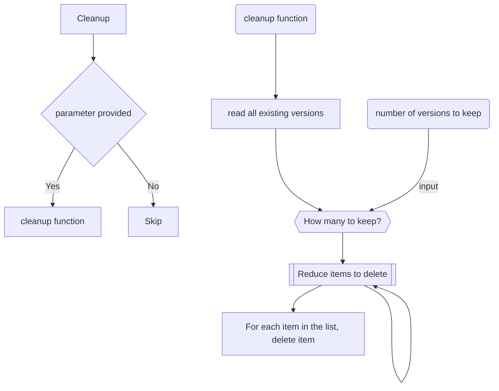
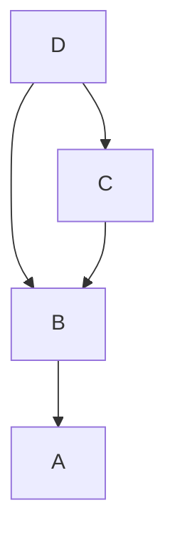
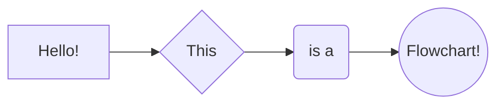
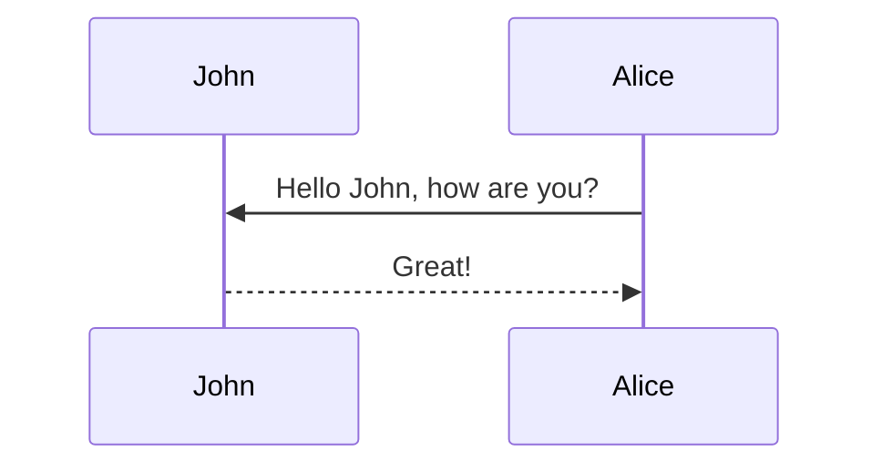
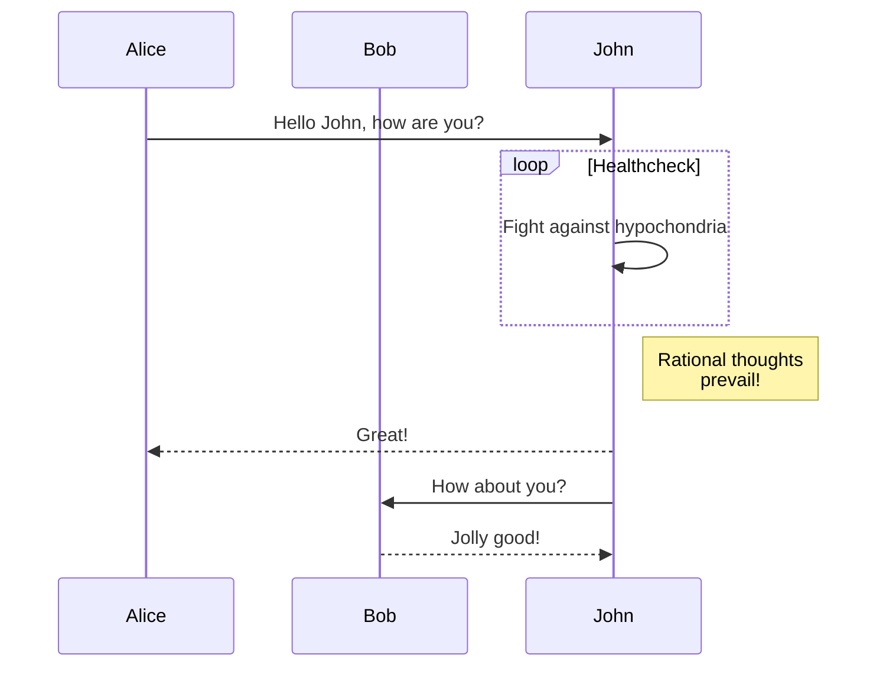
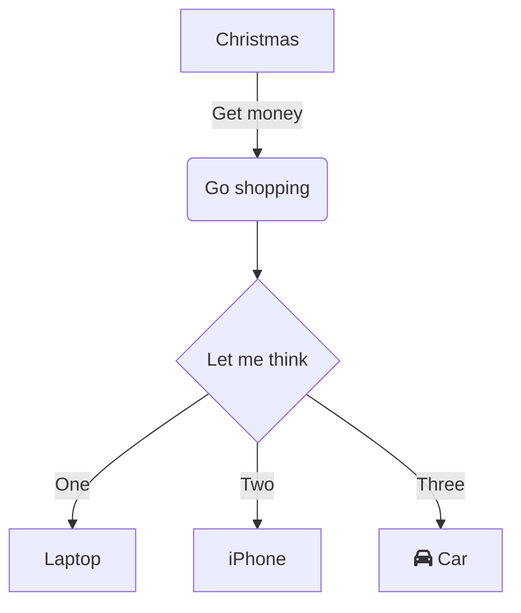

---

### function CleanUp

```mermaid
graph TD
  A[Cleanup] -->  b{parameter provided}
  b -->|Yes| c[cleanup function]
  b -->|No| d[Skip]
  B(cleanup function)
  B --> e[read all existing versions]
  e -->f{{How many to keep?}}
  g(number of versions to keep) -->|input| f 
  f --> h[[Reduce items to delete]]
  h --> h
  h --> i[For each item in the list, delete item]
```

---

### Graph Down to Top

```mermaid
graph TD;
    D-->C;
    D-->B;
    B-->A;
    C-->B;
```

---

### Graph Left Right

```mermaid
graph LR;
  A[Hello!] --> B{This};
  B --> C(is a);
  C --> D((Flowchart!));
```

---

### Sequence diagram 1

```mermaid
sequenceDiagram
    participant John
    participant Alice
    Alice->>John: Hello John, how are you?
    John-->>Alice: Great!
```

### Sequence diagram 2

```mermaid
sequenceDiagram
    participant Alice
    participant Bob
    Alice->>John: Hello John, how are you?
    loop Healthcheck
        John->>John: Fight against hypochondria
    end
    Note right of John: Rational thoughts <br/>prevail!
    John-->>Alice: Great!
    John->>Bob: How about you?
    Bob-->>John: Jolly good!
```

### Christmas Shopping

```mermaid
graph TD
  A[Christmas] -->|Get money| B(Go shopping)
  B --> C{Let me think}
  C -->|One| D[Laptop]
  C -->|Two| E[iPhone]
  C -->|Three| F[fa:fa-car Car]
```

---

bla
